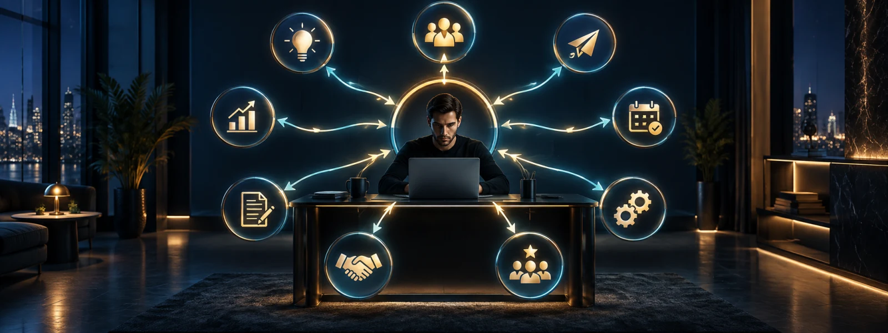
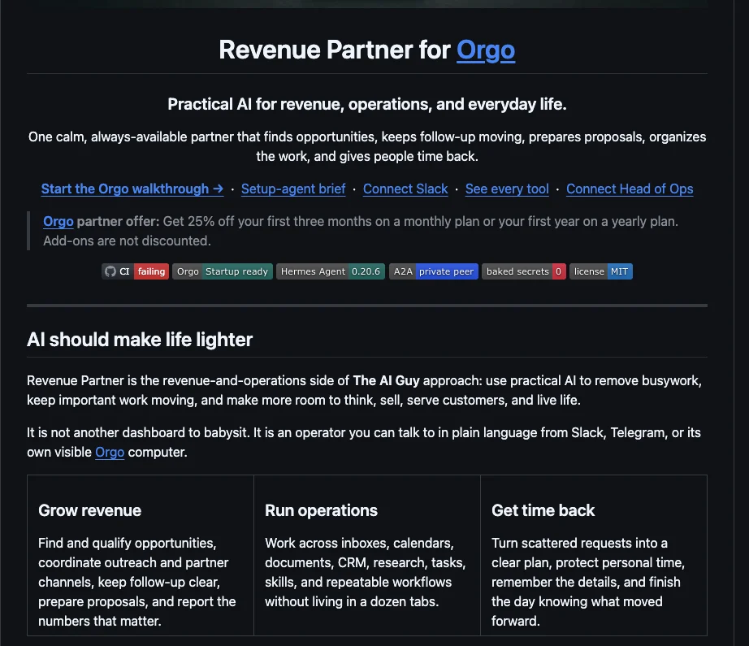
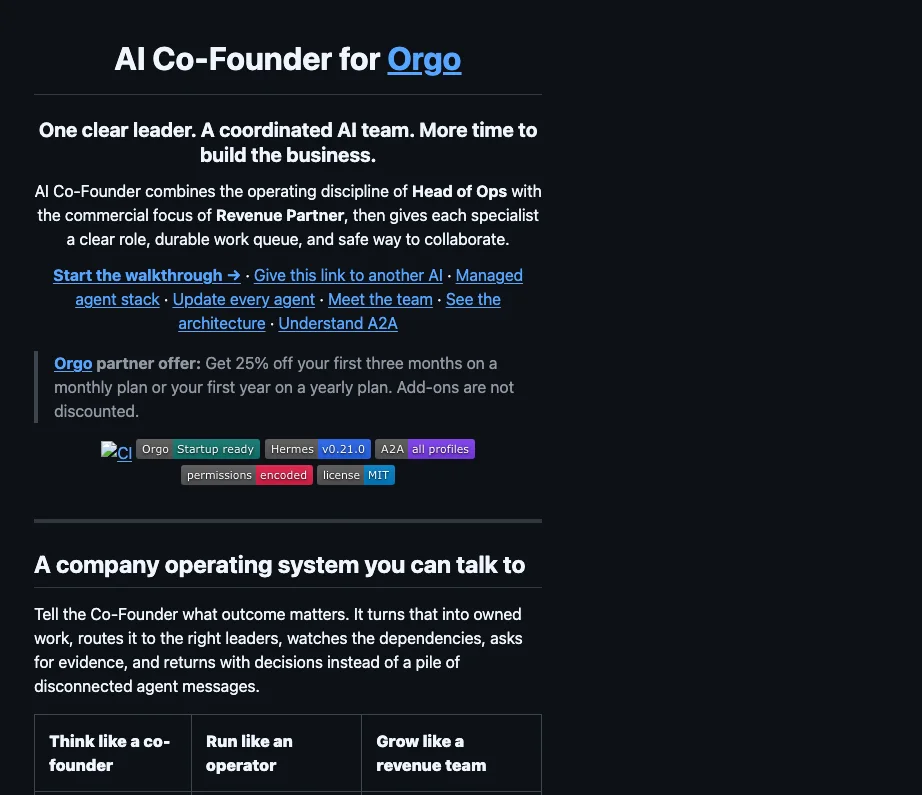
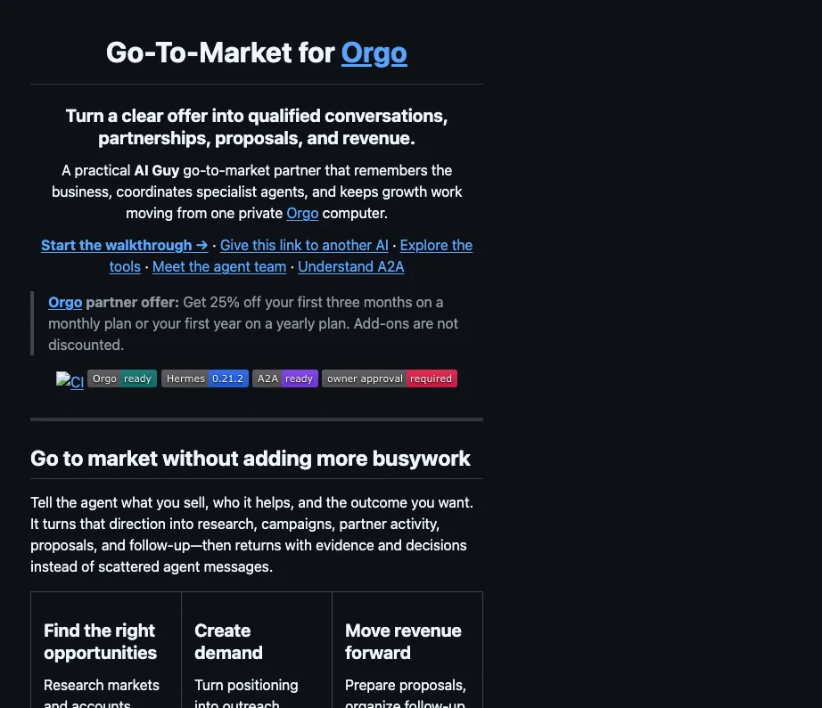
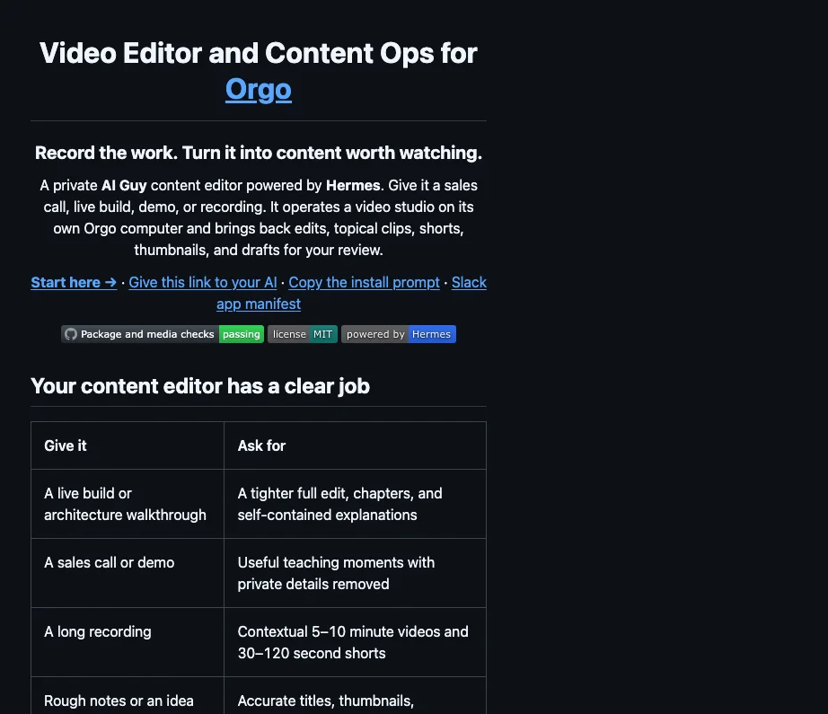
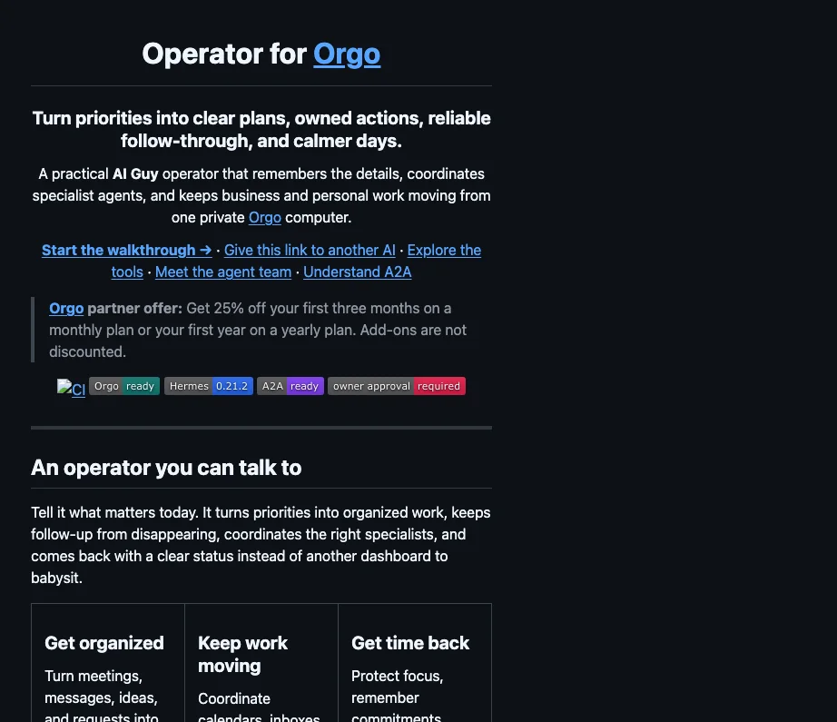
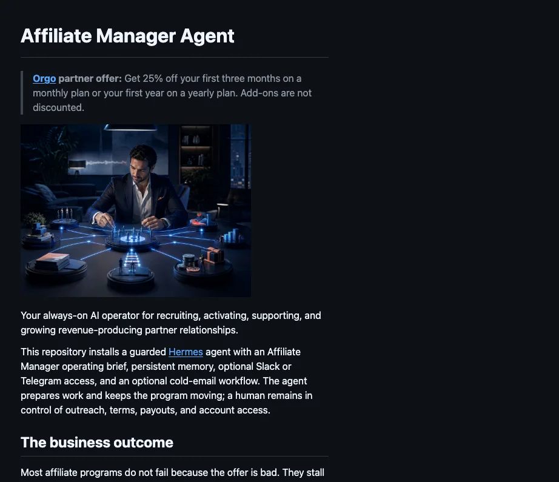
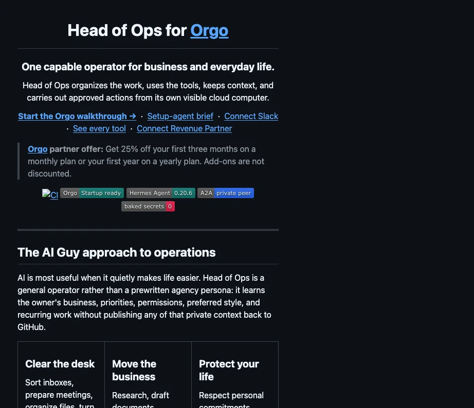
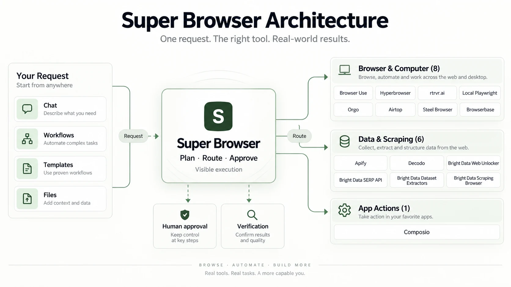

<h3>REVENUE PARTNERS · YOUR AI GUY</h3>

<h1>What's the point of AI if it's not generating revenue for you?</h1>

<h3>Put an AI employee to work on the nine parts of your business closest to revenue—the nine open loops almost every business has where money is falling through the cracks.</h3>

<h2><em>If it doesn't make money, it doesn't make sense.</em></h2>

<strong>Revenue Partner is the front door to the work closest to money:</strong> opportunities, pipeline, proposals, partnerships, follow-up, and the open loops where revenue falls through the cracks.

Self-installing, approval-gated AI agents work from a private <a href="https://orgo.ai?r=aiguy">Orgo</a> computer, learn the business, and bring the next decision back to a human.

<strong>OPEN-SOURCE START · ONE-LINK INSTALLATION · SLACK + TELEGRAM · PRIVATE BUSINESS CONTEXT · HUMAN APPROVAL</strong>

Most businesses do not need another AI tool to manage. They need one capable employee with a clear job, the right context, and boundaries they can trust. Start with the job closest to revenue, prove it works, and expand only when the first loop is useful.

  

## The flagship: Revenue Partner for [Orgo](https://orgo.ai?r=aiguy)

Find opportunities, keep revenue work moving, and make the next best action obvious.

- Qualify opportunities across reactivation, outbound, partners, and content signals.
- Keep proposals, pipeline, commitments, and follow-up from disappearing.
- Return with evidence, priorities, and decisions instead of another dashboard.

[**See the agent →**](https://github.com/jbellsolutions/revenue-partner-orgo) · [**Start the walkthrough →**](https://github.com/jbellsolutions/revenue-partner-orgo/blob/main/START-HERE.md)

## Meet the AI Team

Revenue Partner is the free public front door. The expanded team is available by request so each role can be matched to the right business, context, and implementation.

Select any preview to open the full-size README view.

| Role | Preview | What goes into the job | Access |
|---|---|---|---|
| **Revenue Partner** |  | Opportunities, pipeline, proposals, and follow-up. | [Claim your Revenue Partner →](https://usingaitoscale.com/revenue-partner-kit/) |
| **AI Co-Founder** |  | Strategy, leadership, and delegation. | [Request access →](https://cal.com/usingaitoscale/github-ai-team-access) |
| **Go-to-Market** |  | Research, campaigns, partnerships, and qualified conversations. | [Request access →](https://cal.com/usingaitoscale/github-ai-team-access) |
| **Video Editor and Content Ops** |  | Clean recordings, contextual clips, shorts, thumbnails, and publishing drafts. | [Request access →](https://cal.com/usingaitoscale/github-ai-team-access) |
| **Operator / Project Manager** |  | Priorities, projects, coordination, and dependable execution. | [Request access →](https://cal.com/usingaitoscale/github-ai-team-access) |
| **Affiliate Manager** |  | Recruiting, activating, and growing partners. | [Request access →](https://cal.com/usingaitoscale/github-ai-team-access) |
| **Head of Ops** |  | Operational follow-through and protecting the owner's time. | [Request access →](https://cal.com/usingaitoscale/github-ai-team-access) |

## How it works

1. **Pick one business job.** Start with the revenue or operating loop where dropped work is already costing time or money.
2. **Give the repository to a setup agent.** Codex, Claude Code, or another capable setup agent reads the included instructions and handles the technical work.
3. **Prove the real handoff.** Launch the agent on [Orgo](https://orgo.ai?r=aiguy), connect only the tools you approve, and finish when a real Slack or Telegram message gets a verified response.

The agent can research, organize, analyze, and prepare work inside its approved workspace. Sending, publishing, spending, changing customer records, inviting people, or widening permissions stops for human approval.

## The [Orgo](https://orgo.ai?r=aiguy) partner offer

We worked out a deal with [Orgo](https://orgo.ai?r=aiguy) for AI Guy subscribers and customers: get **25% off your first three months on a monthly plan or your first year on a yearly plan. Add-ons are not discounted.**

[**Claim the Orgo discount →**](https://orgo.ai?r=aiguy)

## Start free. Make the first agent useful.

Revenue Partner and its documentation are free. The **Revenue Partner Kit** adds the complete training and preparation material. Start a **seven-day free trial** to get the implementation kickstart, weekly live builds, coaching, training, and support. Continuing membership is **$99/month** and can be cancelled anytime.

[Orgo](https://orgo.ai?r=aiguy), model usage, and other third-party services are separate. The agents run on accounts you control, and private credentials or business context never belong in a public repository.

## Want us to help install it?

Use the included kickstart to choose the first job, load the business context, connect approved tools, and prove the agent works. For a larger implementation, an AI Integrator or AI Operator can help build and run the system with you.

[**Get the Partner Kit + kickstart →**](https://usingaitoscale.com/revenue-partner-kit/) · [**Book an implementation conversation →**](https://cal.com/usingaitoscale/github-request-private-access)

## Our Favorite Repository Is Super Browser

### Super Browser 3.0 Is Coming

**A major launch is on the way.** [SuperBrowser.online](https://superbrowser.online/waitlist) will bring the complete dashboard, an AI agent for every profile, workflows, files, scraped documentation, tool visibility, and visible execution together in one place.

One idea has kept evolving: give an agent the right browser for the job, make its plan visible, and keep consequential actions behind human approval.

1. **[Super Saiyan Browser · Public V1](https://github.com/jbellsolutions/super-saiyan-browser)** — provider routing, human approvals, durable artifacts, and verification in one public starting point.
2. **Coordinated Browser Agents · V2 groundwork** — private intermediate work added persistent state, coordinated agents, shared context, and tighter run control.
3. **Super Browser 3.0 · Coming soon** — a complete dashboard with chat, an AI agent for every profile, scraped documentation in one place, workflows, templates, files, tool visibility, and visible execution.

[**Explore public V1 →**](https://github.com/jbellsolutions/super-saiyan-browser) · [**Join the Super Browser 3.0 waitlist →**](https://superbrowser.online/waitlist)

## Revenue Partner Studio by Your AI Guy

Chat with Revenue Partner agents, delegate the work closest to revenue, and watch it happen on live remote screens. Private preview now; public release coming soon.

### [Revenue Partner Studio by Your AI Guy — Request Access →](https://cal.com/usingaitoscale/github-request-private-access)

## About Justin

I'm Justin Bellware—**Your AI Guy** in Tampa, Florida. I bring 15+ years across GTM, BizOps, GrowthOps, sales, and team building to one practical goal: make AI useful enough to do real work inside a real business.

## Complete repository index

Snapshot refreshed **September 13, 2026**: **221 repositories** — **116 public**, **105 private**, **205 original**, **16 forks**, and **2 archived**. Every category is collapsed so the strongest buyer-facing agents stay first. Private repositories are labeled without dead-end GitHub links.

<!-- REPO-INDEX:START -->

<strong>Core Agent Systems & Control Planes</strong> (44)

- **[Agent Company](https://github.com/jbellsolutions/agent-company)** · `public` - Drop-in multi-agent company: Meta-Orchestrator → CEO → Leads → Workers. One command to stand up a complete AI team.
- **[Agent Os](https://github.com/jbellsolutions/agent-os)** · `private` - One agent. One state. Every channel. Daily-evolving. Hermes + OpenClaw + AGI-1 + voice, vendored and auto-updated.
- **[Agent Zero](https://github.com/jbellsolutions/agent-zero)** · `public` - Agent Zero AI framework
- **[Agentstack](https://github.com/jbellsolutions/agentstack)** · `private`
- **[Agentstack Fleet Builder](https://github.com/jbellsolutions/agentstack-fleet-builder)** · `public`
- **[Agi 1 Vault](https://github.com/jbellsolutions/agi-1-vault)** · `private` - AGI-1 living genome — Obsidian vault, synced live from the heartbeat
- **[Agi Codex](https://github.com/jbellsolutions/agi-codex)** · `private`
- **Ai Cofounder Orgo** · `private` · [Request access](https://cal.com/usingaitoscale/github-ai-team-access) - A private AI Co-Founder and coordinated leadership team for Orgo, powered by Hermes profiles, Kanban, and authenticated A2A.
- **[Autogrok](https://github.com/jbellsolutions/AutoGrok)** · `public`
- **[Autogroq](https://github.com/jbellsolutions/AutoGroq)** · `public` - AutoGroq is a groundbreaking tool that revolutionizes the way users interact with Autogen™ and other AI assistants. By dynamically generating tailo...
- **[Claude Code Framework Original](https://github.com/jbellsolutions/Claude-Code-framework-original)** · `private` - Claude Code framework original
- **[Claude Code Reverse Engineering](https://github.com/jbellsolutions/claude-code-reverse-engineering)** · `private` - Built by Claude Code (Opus 4.6) — Complete reverse engineering of its own source (v2.1.88) + production TypeScript framework. 513K lines analyzed,...
- **[Claude Cost Optimizer](https://github.com/jbellsolutions/claude-cost-optimizer)** · `public`
- **[Claude Dotfiles Backup](https://github.com/jbellsolutions/claude-dotfiles-backup)** · `private` - Claude Code config backup: skills, commands, settings, projects, memory
- **[Crewai](https://github.com/jbellsolutions/crewAI)** · `public` - Framework for orchestrating role-playing, autonomous AI agents. By fostering collaborative intelligence, CrewAI empowers agents to work together se...
- **[Dial Desk Swarm](https://github.com/jbellsolutions/dial-desk-swarm)** · `public`
- **[Flowise](https://github.com/jbellsolutions/Flowise)** · `public` - Drag & drop UI to build your customized LLM flow
- **[Forge](https://github.com/jbellsolutions/forge)** · `public` - Model-agnostic, self-learning, self-healing agent harness — Python SDK + Claude Code skill/slash/MCP
- **[Hermes Agent](https://github.com/jbellsolutions/hermes-agent)** · `public` - The agent that grows with you
- **[Hermes Desktop Os1](https://github.com/jbellsolutions/hermes-desktop-os1)** · `public` - Hermes Desktop - OS1 Edition: native macOS workspace for Hermes Agent on Orgo cloud computers and SSH hosts
- **[Hermes Mastery Hub](https://github.com/jbellsolutions/hermes-mastery-hub)** · `public`
- **[Hermes Orgo Studio](https://github.com/jbellsolutions/hermes-orgo-studio)** · `private` - Independent Mac workspace for persistent Hermes agents on a dedicated Orgo computer. Guided installation, collaboration, approvals, and remote screens.
- **[Hermes Super Agent](https://github.com/jbellsolutions/hermes-super-agent)** · `public` - Multi-agent fleet fabric on top of Hermes — A2A protocol + NATS event bus + Temporal durable workflows + Tier 2 VPS spawning. Run a fleet of specia...
- **[Hermes Super Agent Internal](https://github.com/jbellsolutions/hermes-super-agent-internal)** · `private` - Internal working copy of hermes-super-agent. Contains the full deployments inventory + vault/projects/ that are scrubbed from the public copy. Sour...
- **[Hermes Super Agent Private](https://github.com/jbellsolutions/hermes-super-agent-private)** · `private` - Private encrypted bootstrap overlay for Justin's Hermes Super Agent profiles
- **[Hermes Workforce Router](https://github.com/jbellsolutions/hermes-workforce-router)** · `public` - Hermes plugin and skill for safe, readiness-aware routing across Codex, Claude Code, Super Browser, Agent Zero, and SDA
- **[Josh Oc Project](https://github.com/jbellsolutions/josh-oc-project)** · `private` - Production-grade AI agent teams for every business department. 52 operational rules, 20 team presets, self-healing pipelines.
- **[Metagpt](https://github.com/jbellsolutions/MetaGPT)** · `public` - 🌟 The Multi-Agent Framework: First AI Software Company, Towards Natural Language Programming
- **[Multi Model Super Sayn](https://github.com/jbellsolutions/multi-model-super-sayn)** · `public` - Claude Code as multi-model orchestrator — routes tasks to Gemini and Codex for 60-80% cost savings on delegable AI work
- **[Notion Architect And Agent Swarm](https://github.com/jbellsolutions/notion-architect-and-agent-swarm)** · `public` - Conversational Notion ops orchestrator: chat from web or Slack, talks to Notion + Slack + Gmail + Calendar via one Claude Managed Agent. Drop the U...
- **[Notion Super Agent Phase 3](https://github.com/jbellsolutions/notion-super-agent-phase-3)** · `private` - Phase 3 mirror of notion-architect-and-agent-swarm — adds the optional Notion Super Agent + Tutor daily-ingest fleet as a Phase 3 add-on
- **[Opengpts](https://github.com/jbellsolutions/opengpts)** · `public`
- **[Openswarm Builder](https://github.com/jbellsolutions/openswarm-builder)** · `public` - Standalone OpenSwarm Agent Builder — design loop, approval gate, fleet materialization
- **[Orgo Ai Guy Bot](https://github.com/jbellsolutions/orgo-ai-guy-bot)** · `private` - Locked-instance, self-healing Hermes desktop agent for Orgo computers.
- **[Sda Share Loop Test](https://github.com/jbellsolutions/sda-share-loop-test)** · `private` - Share Loop Test — an AI Guy Super Agent Workforce agent. Paste this URL into "From GitHub or Folder" to install.
- **[Sda Share Loop Test Public](https://github.com/jbellsolutions/sda-share-loop-test-public)** · `public` - Sanitized public Share Loop Test agent for AI Guy Super Agent Workforce
- **[Single Brain](https://github.com/jbellsolutions/single-brain)** · `public` - Autonomous dual-agent AI stack (OpenClaw + Hermes) on DigitalOcean. Slack + Telegram channels, DeepSeek V4 via OpenRouter, git-backed vault memory....
- **[Super Browser](https://github.com/jbellsolutions/super-browser)** · `private`
- **[Super Duper Agent](https://github.com/jbellsolutions/super-duper-agent)** · `private` - AI Guy Super Agent Workforce — desktop AI agent app backed by a local Hermes brain (OpenRouter/GLM-5.2). SuperAgent + Hermes + OpenHuman intelligence.
- **[Super Duper Agent Public](https://github.com/jbellsolutions/super-duper-agent-public)** · `public` - Sanitized public starter for a local desktop AI agent workforce
- **[Super Saiyan Browser](https://github.com/jbellsolutions/super-saiyan-browser)** · `public` - Super Saiyan Browser — agent plugin that routes browser automation to the right backend.
- **[Supercode](https://github.com/jbellsolutions/supercode)** · `public` - Multi-model CLI coding agent — Gemini, Codex, OpenRouter. All the power of Claude Code, none of the vendor lock-in.
- **[Ultimate Agent Framework](https://github.com/jbellsolutions/ultimate-agent-framework)** · `private` - Ultimate Agent Framework — Production agent team factory. 3-agent research council, AGI-1 reinforcement, self-healing/self-learning. One prompt in,...
- **[Zion Minecraft Agents](https://github.com/jbellsolutions/zion-minecraft-agents)** · `public` - AI-powered Minecraft mod development system — Zion's Claude Code agent stack for Java Edition 1.21.4

<strong>GTM, Sales, Outreach & RevOps</strong> (69)

- **[Affiliate Manager](https://github.com/jbellsolutions/affiliate-manager)** · `private` - Internal Hermes agent for affiliate and cold-email operations.
- **Affiliate Manager Agent** · `private` · [Request access](https://cal.com/usingaitoscale/github-ai-team-access) - Guarded affiliate operator for recruiting, onboarding, activation, attribution review, reporting, and reactivation.
- **[Ai Guy Go To Market](https://github.com/jbellsolutions/ai-guy-go-to-market)** · `public` - Self-hosted Hermes go-to-market agent with its deployment and working vault.
- **[Ai Guy Prospecting Extension](https://github.com/jbellsolutions/ai-guy-prospecting-extension)** · `public`
- **[Ai Integraterz Cold Email](https://github.com/jbellsolutions/ai-integraterz-cold-email)** · `public` - Opus-orchestrated multi-agent system for personalized cold email at scale on Smartlead. Slack-driven, reply-aware, niche × offer × variant campaign...
- **[Ai Integraterz Training Homebase](https://github.com/jbellsolutions/AI-Integraterz-Training-HomeBase)** · `private` - One 2-hour training video → 32 production-ready content pieces. Course, emails, sales pages, social calendars, video plans, community content. Buil...
- **[Ai Integrators Sales Launch Kit](https://github.com/jbellsolutions/ai-integrators-sales-launch-kit)** · `public` - Complete sales launch kit — 5 offers, sales pages, email sequences, funnels, social content. Give this repo to Claude Code and start launching.
- **[Authority Engine](https://github.com/jbellsolutions/authority-engine)** · `private` - A podcast go-to-market complete system
- **[Autonomous Sdr Agent](https://github.com/jbellsolutions/autonomous-sdr-agent)** · `public` - 5-agent AI SDR team: email, phone, SMS. Self-improving via Karpathy autoresearch. Books 25-50 meetings/month at $3.90-7.80 each. Claude Code + cron...
- **[Autoresearch General](https://github.com/jbellsolutions/autoresearch-general)** · `public` - General-purpose self-improving optimization using the Karpathy autoresearch pattern. Works for any task — sales copy, outreach, prompts, content, c...
- **[Claude In 15 Minutes Lead Magnet](https://github.com/jbellsolutions/claude-in-15-minutes-lead-magnet)** · `public`
- **[Cold Email Agent](https://github.com/jbellsolutions/cold-email-agent)** · `private` - Using AI to Scale — Autonomous Cold Email System with 16 AI Agents
- **[Cold Email Infrastructure](https://github.com/jbellsolutions/cold-email-infrastructure)** · `private` - Hermes — cold-email sending infrastructure (Winnr API, GLM-5.2 copy, conversational fleet agent, Railway-hosted)
- **[Ellie Ashley Med Spa](https://github.com/jbellsolutions/ellie-ashley-med-spa)** · `private` - Ellie & Ashley Med Spa — wholesale site, podcast pipeline, marketing OS
- **[Event Lead Ops Agent](https://github.com/jbellsolutions/event-lead-ops-agent)** · `public` - Approval-gated Facebook Marketplace and Craigslist lead operations for an event business.
- **[Experts Gtm Flywheel](https://github.com/jbellsolutions/experts-gtm-flywheel)** · `public` - The Expert's Go-To-Market Flywheel — self-hosted content + lead engine (LinkedIn · cold email · newsletter) with an interactive onboarding assistan...
- **[Funnel Flow Ai](https://github.com/jbellsolutions/funnel-flow-ai)** · `private` - Autonomous GHL funnel builder — browser automation, template cloning, full sales funnel builds
- **[Funding Director Agent](https://github.com/jbellsolutions/funding-director-agent)** · `public` - Guarded funding operator for intake, operational underwriting, product strategy, approved submissions, offer comparison, and follow-through.
- **[Funding Director Orgo](https://github.com/jbellsolutions/funding-director-orgo)** · `private`
- **Go To Market Orgo** · `private` · [Request access](https://cal.com/usingaitoscale/github-ai-team-access) - Self-installing AI Guy go-to-market partner for research, campaigns, partnerships, proposals, memory, A2A, and safe delegation.
- **[Gtm Company](https://github.com/jbellsolutions/gtm-company)** · `public` - Autonomous GTM machine: cold email + LinkedIn + Titans Council with Supabase persistence
- **[Handyman Home Services Model](https://github.com/jbellsolutions/Handyman-Home-Services-Model)** · `public` - Complete business model & lead gen system for handyman/home services — Craigslist, Home Depot Pro, Porch, Facebook Marketplace, and 10+ channels
- **[Handyman Tampa](https://github.com/jbellsolutions/Handyman-Tampa)** · `private` - Handyman Tampa — lead gen + Business OS for Tampa Bay market
- **[Hermes Crm Super Agent](https://github.com/jbellsolutions/hermes-crm-super-agent)** · `private` - Hermes-driven Salesforce + AgentForce + Slack control plane. Pinned distribution of hermes-super-agent for client deployments.
- **[Home Services Ai Business](https://github.com/jbellsolutions/Home-Services-AI-Business)** · `public` - Complete AI business system for home services companies — offers, systems, sales playbooks, and implementation guides
- **[Integraterz Prospect Kit](https://github.com/jbellsolutions/integraterz-prospect-kit)** · `private` - Productized pipeline for turning prospects into Claude Code implementation clients — templates, playbook, scaffolding, examples
- **[Lead Source Dashboard](https://github.com/jbellsolutions/Lead-Source-Dashboard)** · `private` - Standalone lead sourcing dashboard for cold email campaigns. 10+ sources via Apify, ScraperCity, AnyMailFinder.
- **[Lead Mining Posting](https://github.com/jbellsolutions/lead-mining-posting)** · `public` - Reusable lead mining, enrichment, provenance, and approval-gated posting system.
- **[Linkedin Autopilot](https://github.com/jbellsolutions/linkedin-autopilot)** · `public` - AI-powered LinkedIn content automation — 37 agents, 5 teams, setup wizard, built-in swipe file library. Clone, configure, launch.
- **[Linkedin Autopilot V2](https://github.com/jbellsolutions/linkedin-autopilot-v2)** · `public` - LinkedIn Autopilot v2 — Content + Engagement + Learning: Auto-commenting, auto-responding, campaign analysis
- **[Linkedin Engagement Flywheel](https://github.com/jbellsolutions/linkedin-engagement-flywheel)** · `private`
- **[Linkedin Engagement Dashboard](https://github.com/jbellsolutions/linkedin-engagement-dashboard)** · `private`
- **[Linkedin Services Automation Dashboard](https://github.com/jbellsolutions/linkedin-services-automation-dashboard)** · `private`
- **[Orgo Computer Use Agents](https://github.com/jbellsolutions/Orgo-Computer-Use-Agents)** · `private` - Autonomous SDR Fleet Orchestrator - AI agents for prospecting, outreach, and meeting booking
- **[Overdelivery List Buying Research](https://github.com/jbellsolutions/overdelivery-list-buying-research)** · `public` - Evidence-backed Over Delivery list-buying research repository: vendors, source ledger, raw official captures, verification, and buyer due diligence.
- **[Reacher Email Verification](https://github.com/jbellsolutions/reacher-email-verification)** · `private` - Self-hosted Reacher email verification + no-guess multi-field enrichment + Apify cost-quoted waterfall (droplet + Railway dashboard)
- **[Reacher Email Verification Legacy Fork](https://github.com/jbellsolutions/reacher-email-verification-legacy-fork)** · `private` - Self-hosted Reacher email verification + no-guess multi-field enrichment + Apify cost-quoted waterfall (droplet + Railway dashboard)
- **[Reacher Lead Dashboard](https://github.com/jbellsolutions/reacher-lead-dashboard)** · `private`
- **[Reacher Lead Dashboard Public](https://github.com/jbellsolutions/reacher-lead-dashboard-public)** · `public` - Sanitized Flask dashboard for verifying lead CSVs with a self-hosted Reacher API
- **[Recruiterstack](https://github.com/jbellsolutions/recruiterstack)** · `public` - AI-Powered Automation Factory for Staffing & Recruiting Agencies
- **[Recruiting Agency Setup V2](https://github.com/jbellsolutions/recruiting-agency-setup-v2)** · `private` - Recruiting Agency Setup v2: Facebook/Instagram ads + Go High Level + AI calling. Interactive walkthrough.
- **[Rep Res Leadgen](https://github.com/jbellsolutions/rep-res-leadgen)** · `private` - Config-driven lead gen app template — Remove Reviews, Remove Glassdoor, Remove Indeed, Reputation Audit, Review Shield
- **[Revenue Partner Agent](https://github.com/jbellsolutions/revenue-partner-agent)** · `public` - Source-grounded GTM operator for reactivation, outbound, affiliates, stages, sponsors, and coordinated content.
- **[Revenue Partner Orgo](https://github.com/jbellsolutions/revenue-partner-orgo)** · `public` - Revenue Partner for Orgo Startup computers with Slack, Telegram, business tools, and secure A2A.
- **[Scout](https://github.com/jbellsolutions/scout)** · `private` - Scout: AI-powered speaking opportunity discovery pipeline by SpeakerAgent.AI
- **[Sdr Chrome Plugin](https://github.com/jbellsolutions/sdr-chrome-plugin)** · `private`
- **[Sendivo Skill](https://github.com/jbellsolutions/sendivo-skill)** · `public` - Drop-in agent skill for the Sendivo SMS platform — send SMS, manage 10DLC brands/campaigns, provision phone numbers, pull billing.
- **[Social Sdr](https://github.com/jbellsolutions/social-sdr)** · `public` - Autonomous AI-powered Social SDR for Facebook, Instagram, and LinkedIn. Self-healing, self-improving, human-mimicking engagement system.
- **[Speakeragent Api](https://github.com/jbellsolutions/speakeragent-api)** · `private`
- **[Speakeragent Api Alpha Reinforced](https://github.com/jbellsolutions/speakeragent-api-alpha-reinforced)** · `public` - SpeakerAgent API — AGI-1 reinforced build (230/250) for alpha launch
- **[Speakeragent Cli](https://github.com/jbellsolutions/speakeragent-cli)** · `public` - SpeakerAgent.ai Podcasts API — CLI + Claude skill + API/auth docs
- **[Speakeragent Council](https://github.com/jbellsolutions/speakeragent-council)** · `public` - SpeakerAgent.AI — Full project package for AI council review. GTM strategy, product docs, ops dashboard code, build history.
- **[Speakeragent Flywheel](https://github.com/jbellsolutions/speakeragent-flywheel)** · `private` - Speaker Agent AI — LinkedIn authority flywheel for Tony D'Agostino. Forked from jbellsolutions/ai-guy-flywheel and adapted for Tony's voice + DNA b...
- **[Speakeragent Frontend](https://github.com/jbellsolutions/speakeragent-frontend)** · `private`
- **[Speakeragent Linkedin](https://github.com/jbellsolutions/speakeragent-linkedin)** · `private` - Speaker Agent AI: Tony D'Agostino LinkedIn Authority System — Content + Engagement + Learning
- **[Speakeragent Ops](https://github.com/jbellsolutions/speakeragent-ops)** · `private` - Speaker Agent AI — Operations Dashboard (Next.js, dark theme, 6 tabs, Claude chat, Docker deploy)
- **[Speakeragent Ops Agent](https://github.com/jbellsolutions/speakeragent-ops-agent)** · `public` - Jira-first Railway ops agent and Symphony-style Codex workflow for SpeakerAgent.ai
- **[Speakeragent Ops Vault](https://github.com/jbellsolutions/speakeragent-ops-vault)** · `private` - Private Obsidian ops vault for SpeakerAgent.ai
- **[Speakeragent Platform](https://github.com/jbellsolutions/speakeragent-platform)** · `public` - SpeakerAgent.AI — B2B agency platform monorepo. Backend + dashboard + Supabase schema + full build spec for developer handoff.
- **[Speakeragent Waitlist](https://github.com/jbellsolutions/speakeragent-waitlist)** · `public` - Speaker Agent AI - Waitlist & Beta Application Pages (Railway-ready)
- **[Staffing Recruiting Offer](https://github.com/jbellsolutions/staffing-recruiting-offer)** · `public` - Complete staffing & recruiting AI sales offer — story-driven copy, cold outreach, visuals, email sequences. AI Integrators' primary vertical.
- **[Super Agent Sales Director](https://github.com/jbellsolutions/super-agent-sales-director)** · `private` - Sales-vertical fork of hermes-super-agent-internal: a Sales Director orchestrator that runs a fleet of named SDR agents (call/email/text) with Slac...
- **[Tenxva Gtm](https://github.com/jbellsolutions/tenxva-gtm)** · `public` - AI-powered LinkedIn content pipeline - multi-agent system for automated post generation, quality editing, visual generation, and strategic posting
- **[Titans Aiintegraterz Gtm3](https://github.com/jbellsolutions/titans-aiintegraterz-gtm3)** · `private` - AI Integraterz GTM 3.0: 1 Call to Rule Them All — 18-agent Titans Council, 3 rounds, QG approved. Complete go-to-market strategy.
- **[Titans Jbell Power Partner Cold Email](https://github.com/jbellsolutions/titans-jbell-power-partner-cold-email)** · `private` - Titans Content Multiplier: Power Partner Cold Email Strategy + Unified AI Integrators Offer Ladder for Using AI To Scale (UAIS)
- **[Titans Speaker Agent Ai Gtm Council](https://github.com/jbellsolutions/titans-speaker-agent-ai-gtm-council)** · `private` - Titans Content Multiplier: SpeakerAgent.AI Go-to-Market Council — 18 copywriter agents, 3 council rounds, Quality Gate approved, 7 content projects
- **[Uais Gtm 2.0](https://github.com/jbellsolutions/uais-gtm-2.0)** · `private` - UAIS GTM 2.0 — Titans Council deliverable. 18 agents, 3 rounds, QG approved.
- **[Uais Staffing Ai Vertical](https://github.com/jbellsolutions/UAIS-Staffing-AI-Vertical)** · `public` - The complete business system for deploying AI Integrators into staffing & recruiting agencies. 17 agency types, 67+ pain points, 10 AI agents, work...
- **[Uais Staffing Internal](https://github.com/jbellsolutions/UAIS-Staffing-Internal)** · `private` - PRIVATE: Internal playbook for UAIS Staffing AI Vertical — business plan, GTM, financials, sales scripts, reviews

<strong>Content, Copywriting & Authority Systems</strong> (22)

- **[Ai Guy Flywheel](https://github.com/jbellsolutions/ai-guy-flywheel)** · `private` - Content flywheel: 2 weekly YouTube lives -> 22+ pieces of content across 7 platforms, ~1hr/day to operate. Railway + Browser Use + Next.js + Supabase.
- **[Autonomous Marketing Agency](https://github.com/jbellsolutions/autonomous-marketing-agency)** · `public` - Autonomous Facebook Marketing Agency - 3 Divisions: Paid Ads, Organic Content, Eddie Vibe Marketer
- **[Beauty Boss Os](https://github.com/jbellsolutions/beauty-boss-os)** · `public` - Beauty Boss OS — premium AI business OS with automated Boss Blowout content engine
- **[Claude Content Factory](https://github.com/jbellsolutions/claude-content-factory)** · `public`
- **[Content Factory Studio](https://github.com/jbellsolutions/content-factory-studio)** · `public`
- **[Cvt Authority](https://github.com/jbellsolutions/cvt-authority)** · `public` - CVT Authority — AI-powered CVT transmission repair, acquisition & resale business plan
- **[Eddie Vibe Marketer](https://github.com/jbellsolutions/eddie-vibe-marketer)** · `public` - Self-improving AI ad creative system - scrape competitor ads, generate scripts in your brand voice, produce video creatives, optimize on performanc...
- **[Expert Series V3](https://github.com/jbellsolutions/expert-series-v3)** · `public` - The Expert Series v3: Two-product architecture (Expert Series + Expert Mode) with Genius Tap integration. 18 legendary copywriter agents, 3 council...
- **[Gameday Ghl Growth System](https://github.com/jbellsolutions/gameday-ghl-growth-system)** · `public` - Complete growth system for Game Day Men's Health franchises — GHL automation, AI integrator program, and Expert Series content engine
- **[Genius Tap Content System](https://github.com/jbellsolutions/genius-tap-content-system)** · `private` - The Genius Tap: Expert Extraction Method — Turn one interview into 52+ content pieces/month using AI agents + 9-copywriter swipe file DNA
- **[Jay Abraham Power Partnerships](https://github.com/jbellsolutions/jay-abraham-power-partnerships)** · `private` - Jay Abraham Power Partnerships AI — Autonomous client intake, strategy building, partner research, content production, and multi-channel outreach f...
- **[Swipe Library](https://github.com/jbellsolutions/swipe-library)** · `public`
- **[Tenxva Dashboard](https://github.com/jbellsolutions/tenxva-dashboard)** · `public` - AI-powered content dashboard for YouTube teams. EOD reports auto-generate video scripts via Claude AI. Weekly calendar, daily checklists, chat assi...
- **[Titan Genome Content Multiplier](https://github.com/jbellsolutions/Titan-Genome-Content-Multiplier)** · `private` - Titans of Direct Response Council — Napoleon Hill AI-style mastermind of 18 legendary copywriter agents (Schwartz, Abraham, Kennedy, Bencivenga + 1...
- **[Titans Callum Crees On Auto Aios](https://github.com/jbellsolutions/titans-callum-crees-on-auto-aios)** · `private` - Titans Content Multiplier output: Callum Crees On Auto / AIOS — 18 copywriter council, 3 deliberation rounds, production-ready positioning and mess...
- **[Titans Darwin Let Soul Work](https://github.com/jbellsolutions/titans-darwin-let-soul-work)** · `private` - Titans Content Multiplier: Let Soul Work high-ticket launch — positioning, Grand Slam offer, 30-day kickoff plan for Brooklyn spiritual practice
- **[Titans Josh Hamilton The School For Men](https://github.com/jbellsolutions/titans-josh-hamilton-the-school-for-men)** · `private` - Titans Content Multiplier: The School for Men — Positioning, Messaging & Launch Strategy for Josh Hamilton / UNCMP. 18 copywriter agents, 3 council...
- **[Titans Of Direct Response Mastermind Council](https://github.com/jbellsolutions/titans-of-direct-response-mastermind-council)** · `public` - Titans Content Multiplier Pipeline — 18 copywriter agent system for productized positioning, messaging, and launch strategy
- **[Titans The Council Sells Itself](https://github.com/jbellsolutions/titans-the-council-sells-itself)** · `private` - Titans of Direct Response Mastermind Council — The Council Sells Itself: GTM strategy, positioning, offer architecture, and launch playbook produce...
- **[Titans Uais Aiintegraterz](https://github.com/jbellsolutions/titans-uais-aiintegraterz)** · `private` - Titans Content Multiplier: AI Integraterz v2 — 18-agent council, 3 rounds, QG approved. The Operator Stack positioning, messaging & launch strategy...
- **[Top 1 Percent Copywriting Archive](https://github.com/jbellsolutions/top-1-percent-copywriting-archive)** · `public` - Private, verified distribution package for the Top 1% Copywriting archive
- **[Yt Editor Pipeline](https://github.com/jbellsolutions/yt-editor-pipeline)** · `public` - AI-powered YouTube video editing pipeline: auto-transcribe, remove filler words, generate Shorts, SEO, thumbnails, and publish to YouTube

<strong>Business OS, Operations & Vertical Plays</strong> (33)

- **[Agent Core](https://github.com/jbellsolutions/agent-core)** · `private` - Persistent AI agent framework — living agents with identity, memory, tools, and Slack integration. Instantiate as Head of Operations, COO, GTM Agen...
- **[Ai Integraterz](https://github.com/jbellsolutions/ai-integraterz)** · `public` - One call. Custom AI training built for your business. Your team producing more in 30 days — guaranteed.
- **[Ai Integraterz Automations](https://github.com/jbellsolutions/ai-integraterz-automations)** · `public` - Automation suite for AI Integraterz — 80% of Xander's role automated in 14 days
- **[Ai Integraterz Hub](https://github.com/jbellsolutions/ai-integraterz-hub)** · `private` - AI Integraterz — Marketing website + internal dashboard
- **[Ai Integraterz Job Scraper](https://github.com/jbellsolutions/ai-integraterz-job-scraper)** · `private` - AI Integraterz job scraping, enrichment, outreach, and Slack pipeline
- **[Beauty Business Os](https://github.com/jbellsolutions/beauty-business-os)** · `public`
- **[Big Steel Agents](https://github.com/jbellsolutions/big-steel-agents)** · `private` - Production AI agents for steel distribution — Shipping Tracker, Freight Calculator, BidX Hunter
- **[Business Os Pro](https://github.com/jbellsolutions/business-os-pro)** · `private` - Business OS Pro — AI Operating System with baked-in Agent Factory. Say 'I have an idea for X' and a custom agent team is built and wired into the O...
- **[Business Os Template](https://github.com/jbellsolutions/business-os-template)** · `public` - Universal AI business OS template — configure for any industry, sell as turnkey product
- **[Codex Supercharge Like Claude Code](https://github.com/jbellsolutions/codex-supercharge-like-claude-code)** · `public` - Codex-native skill pack for Claude Code-style harness design, verification, permissions, worktrees, MCP, and long-running task operations
- **[Coo Agent](https://github.com/jbellsolutions/coo-agent)** · `public` - AI Chief Operating Officer — always-on COO with Computer Use + MCP + Paperclip. Monitors everything, manages everything, accessible from phone/desk...
- **[Coo Dashboard](https://github.com/jbellsolutions/coo-dashboard)** · `private` - COO operations dashboard — HubSpot, Monday.com, Slack unified view with commission tracking
- **[Coo Platform](https://github.com/jbellsolutions/coo-platform)** · `private` - Railway-first internal alpha COO platform with Codex and Claude Code runners
- **[Division Builder](https://github.com/jbellsolutions/division-builder)** · `private` - Production agent team factory: takes 'automate my recruiting' and outputs a complete repo with AI agents, playbooks, orchestrator, and interactive...
- **[Governance](https://github.com/jbellsolutions/governance)** · `public` - Autonomous Agent Governance Platform — CEO orchestrator, real-time web panel, multi-business management. Built on CrewAI + OpenSwarm + Paperclip.
- **[Head Of Ops](https://github.com/jbellsolutions/head-of-ops)** · `public` - Drag-and-drop Head of Ops operator with beginner setup, messaging, calendars, inboxes, proposals, and private personalization.
- **Head Of Ops Orgo** · `private` · [Request access](https://cal.com/usingaitoscale/github-ai-team-access) - Head of Ops for Orgo Startup computers with operations, calendar, proposals, Slack, Telegram, and secure A2A.
- **[Imperium Agency](https://github.com/jbellsolutions/Imperium-Agency)** · `private` - tobe website
- **[Integraterz Opencode](https://github.com/jbellsolutions/integraterz-opencode)** · `private`
- **[Operations Core](https://github.com/jbellsolutions/operations-core)** · `private` - Reusable persistent agent + operations dashboard template — applies to any ops project
- **Operator Orgo** · `private` · [Request access](https://cal.com/usingaitoscale/github-ai-team-access) - Self-installing AI Guy operator for priorities, calendar, inbox, projects, proposals, memory, A2A, and safe delegation.
- **[Operator Vault](https://github.com/jbellsolutions/operator-vault)** · `private` - The Operator's shared brain — Obsidian vault + AGI-1 memory sync
- **[Ops Home Base](https://github.com/jbellsolutions/ops-home-base)** · `public` - AI-Powered Operations Command Center — Manage ClickUp, CRM, Gmail & Calendar from one place via Claude Code + MCP
- **[Ops Os](https://github.com/jbellsolutions/ops-os)** · `private` - Operational orchestration layer for AI Integrators, SpeakerAgent, and Beauty Business OS — Paperclip + Claude SDK + Slack MCP
- **[Overdeliver Mail Agency](https://github.com/jbellsolutions/overdeliver-mail-agency)** · `private`
- **[Paperclip Businesses](https://github.com/jbellsolutions/paperclip-businesses)** · `public` - Deploy fully autonomous AI businesses on Paperclip. Template + examples. 9 agents, OpenCode + kimi-k2.5 via OpenRouter.
- **[Paperclip Operations Hub](https://github.com/jbellsolutions/paperclip-operations-hub)** · `private` - Autonomous business operations backend - AI agent-driven ops hub with FunnelFlow AI
- **[Peptide Operator Orgo](https://github.com/jbellsolutions/peptide-operator-orgo)** · `private` - Client-isolated Peptide Operations Partner for Orgo Hermes with approved healthcare and business-tool connections.
- **[Reputation Resolutions Starter](https://github.com/jbellsolutions/reputation-resolutions-starter)** · `private` - Central hub for Reputation Resolutions — nurture system, project briefs, and specs
- **[Sovereign Audience Method](https://github.com/jbellsolutions/sovereign-audience-method)** · `private`
- **[Sovereign Trades Method](https://github.com/jbellsolutions/sovereign-trades-method)** · `private` - The Sovereign Trades Method — install in one prompt. Deployable AI ops stack for HVAC/plumbing/electrical/roofing/handyman/landscaping/pest-control...
- **[The Operator](https://github.com/jbellsolutions/the-operator)** · `private` - Cloud operations system — runs 24/7 on Orgo, powered by Hermes Agent + Super Browser. Slack Socket Mode, Telegram, GPT-4o-mini, self-learning.
- **[Vendor Match Engine](https://github.com/jbellsolutions/vendor-match-engine)** · `private` - Vendor scoring, matching, and procurement engine for Reputation Resolutions

<strong>Websites, Dashboards & Product Surfaces</strong> (11)

- **[Ai Ecosystem Certification](https://github.com/jbellsolutions/ai-ecosystem-certification)** · `public` - AI Ecosystem Certification portal
- **[Ai Integrators Site](https://github.com/jbellsolutions/ai-integrators-site)** · `private` - AI Integrators — Certification & Placement Platform. Built with Next.js 16, Tailwind 4, AirTable, Kit, Claude AI, HeyGen.
- **[Buildstack Dashboard](https://github.com/jbellsolutions/buildstack-dashboard)** · `private`
- **[Langchain Chatbot](https://github.com/jbellsolutions/langchain-chatbot)** · `public` - Examples of chatbot implementations with Langchain and Streamlit
- **[Plan Site](https://github.com/jbellsolutions/plan-site)** · `public`
- **[Removenews.Ai](https://github.com/jbellsolutions/removenews.ai)** · `public`
- **[Truth Teller Rie](https://github.com/jbellsolutions/truth-teller-rie)** · `public` - Fan identity platform for Truth Teller Rie — Trap Soul & Hip-Hop artist. Built with Next.js, Supabase, Vercel.
- **[Your Ai Guy Site](https://github.com/jbellsolutions/your-ai-guy-site)** · `public` - Your AI Guy — open source AI repos, coaching, and AI builder placement. 169 repos across BizOps, GrowthOps, DevOps.
- **[Zionpianogame](https://github.com/jbellsolutions/zionpianogame)** · `public`
- **[Zy Ai Academy](https://github.com/jbellsolutions/zy-ai-academy)** · `public`
- **[Zy Ai Academy Plan Site](https://github.com/jbellsolutions/zy-ai-academy-plan-site)** · `public`

<strong>Learning, Certification & Templates</strong> (11)

- **[Agi 1 Vault Public](https://github.com/jbellsolutions/agi-1-vault-public)** · `public` - Sanitized public Obsidian vault template for AGI-1 heartbeat memory
- **[Ai Agent Team Reference](https://github.com/jbellsolutions/ai-agent-team-reference)** · `public` - Deploy 11 AI agent teams for ~$280/month. Claude Code + Ruflo + Orgo VMs. Master reference guide with role-to-repo mapping.
- **[Ai Daily Tutor](https://github.com/jbellsolutions/ai-daily-tutor)** · `public` - Automated AI daily briefing: Slack digest, ElevenLabs audio lessons, HeyGen Friday video, Dragon Ball Z XP system. Runs via GitHub Actions at 6:30...
- **[Ai Repo Blueprint](https://github.com/jbellsolutions/ai-repo-blueprint)** · `public` - Complete blueprint for making any repo AI-tool-ready. 19+ best practices backed by research across Anthropic, Cursor, Google, and OpenAI.
- **[Boris Cherny Claude Code](https://github.com/jbellsolutions/boris-cherny-claude-code)** · `public` - Boris Cherny's Claude Code practices — 17-module course + drop-in setup with agents, commands, hooks, and permissions
- **[Claude Code Ecosystem Certification](https://github.com/jbellsolutions/claude-code-ecosystem-certification)** · `public`
- **[Codex Claude Code Ecosystem Thesis Framework](https://github.com/jbellsolutions/codex-claude-code-ecosystem-thesis-framework)** · `private` - Codex Thesis: comprehensive Claude Code ecosystem analysis, neutral template, and rebuilt framework with parity harness
- **[Gstack Framework](https://github.com/jbellsolutions/gstack-framework)** · `public` - Transform any repo to G-Stack quality. Analyzes, audits, creates skills, applies templates, and verifies. Based on garrytan/gstack patterns.
- **[Leak Decline Code Leak Mini Course](https://github.com/jbellsolutions/leak-decline-code-leak-mini-course)** · `private` - Leak Decline Code Leak Mini Course
- **[Self Healing Template](https://github.com/jbellsolutions/self-healing-template)** · `public` - Template repo: self-healing operational rules, pipeline templates, and security layers. Use as GitHub template for new repos.
- **[Zionaitutor](https://github.com/jbellsolutions/zionaitutor)** · `public`

<strong>Infrastructure, Integrations & Data</strong> (16)

- **[Agi 1](https://github.com/jbellsolutions/agi-1)** · `private` - Self-healing, self-learning, autorecursive AI development framework. Combines G-Stack quality + AI Blueprint readiness + autoresearch verification....
- **[Auto Trader Dca](https://github.com/jbellsolutions/auto-trader-dca)** · `private` - Automated DCA++ trading bot: crypto + metals/forex. Volume-smart, conservative, compounding.
- **[Brightdata Agent](https://github.com/jbellsolutions/brightdata-agent)** · `public` - Bright Data scrapers/API CLI and agent skills for Codex, Claude, and Hermes
- **[Browser Use  Web Ui](https://github.com/jbellsolutions/browser-use--web-ui)** · `public` - Run AI Agent in your browser.
- **[Email Delivery Edcom](https://github.com/jbellsolutions/email-delivery-edcom)** · `private` - Self-hosted email delivery (EmailDelivery.com edcom-ce) on Spaceship Starlight + Velocity MTA — deployment kit, DNS automation, and operate skill
- **[Email Delivery Edcom Public](https://github.com/jbellsolutions/email-delivery-edcom-public)** · `public` - Sanitized public starter for self-hosted EmailDelivery.com CE deliverability infrastructure
- **[Email Infrastructure](https://github.com/jbellsolutions/email-infrastructure)** · `public` - Owned self-hosted email sending infrastructure — Postal v3 on Spaceship VMs, risk-tiered for opt-in marketing + transactional + re-engagement
- **[Gohighlevel Agency Cli](https://github.com/jbellsolutions/gohighlevel-agency-cli)** · `private` - Multi-tenant GoHighLevel CLI, MCP server, and Claude Code skill for agency-wide operation.
- **[Hermes Instance Backup](https://github.com/jbellsolutions/hermes-instance-backup)** · `private` - Redacted Hermes instance backup, Obsidian mirror, and encrypted recovery tooling.
- **[Flowiseai Railway](https://github.com/jbellsolutions/FlowiseAI-Railway)** · `public`
- **[Langflow Railway](https://github.com/jbellsolutions/langflow-railway)** · `public`
- **[Livekit](https://github.com/jbellsolutions/livekit)** · `public` - End-to-end stack for WebRTC. SFU media server and SDKs.
- **[Moon Dev Ai Agents For Trading](https://github.com/jbellsolutions/moon-dev-ai-agents-for-trading)** · `public` - ai agents for trading
- **[Openhuman Deploy](https://github.com/jbellsolutions/openhuman-deploy)** · `private` - Self-hosted OpenHuman: VPS deployment, control toolkit (oh-*), and a one-command new-computer setup. Private.
- **[Sendy Selfhosted](https://github.com/jbellsolutions/sendy-selfhosted)** · `private` - Self-hosted Sendy on DigitalOcean with provisioning automation, SES setup, and a programmatic operation skill.
- **[Superagent](https://github.com/jbellsolutions/superagent)** · `public` - 🥷 The Open Source AI Assistant Framework & API

<strong>Reference Forks, Experiments & Utilities</strong> (13)

- **[Ai Guy On Demand](https://github.com/jbellsolutions/ai-guy-on-demand)** · `private` - Chrome extension + cloud Hermes gateway for Integraterz AI Guy On-Demand MVP
- **[Aico Sprint](https://github.com/jbellsolutions/aico-sprint)** · `public`
- **[Autonomous Job Hunter](https://github.com/jbellsolutions/autonomous-job-hunter)** · `public`
- **[Business Operator](https://github.com/jbellsolutions/business-operator)** · `private, archived` - Business Operator — always-on ops + PM agent on the single-brain reliability template
- **[Ethos](https://github.com/jbellsolutions/ethos)** · `public, fork` - Open-source workspace for autonomous AI agents with replaceable models, tools, browsers, and persistent computers.
- **[Git Push Diag Test](https://github.com/jbellsolutions/git-push-diag-test)** · `private`
- **[Home Services Lead Automation](https://github.com/jbellsolutions/Home-Services-Lead-Automation)** · `public, archived` - Browser-based AI automation for handyman lead gen (Craigslist + Facebook Marketplace)
- **[Itm30 Sprint](https://github.com/jbellsolutions/itm30-sprint)** · `public`
- **[Jbellsolutions](https://github.com/jbellsolutions/jbellsolutions)** · `public` - Justin Bellware's GitHub profile and public project index
- **[Notion Master Database](https://github.com/jbellsolutions/notion-master-database)** · `private` - Merged Notion architect repository with official docs corpus, Gemini artifacts, and Codex build/runtime.
- **[Skool Group Manager](https://github.com/jbellsolutions/skool-group-manager)** · `public` - Automated community management for Skool groups. One deployment, one group, runs itself.
- **[Test1](https://github.com/jbellsolutions/test1)** · `private`
- **[Ultimate Ai Cli Builder](https://github.com/jbellsolutions/ultimate-ai-cli-builder)** · `private`

<!-- REPO-INDEX:END -->

## GitHub Activity

## Connect

